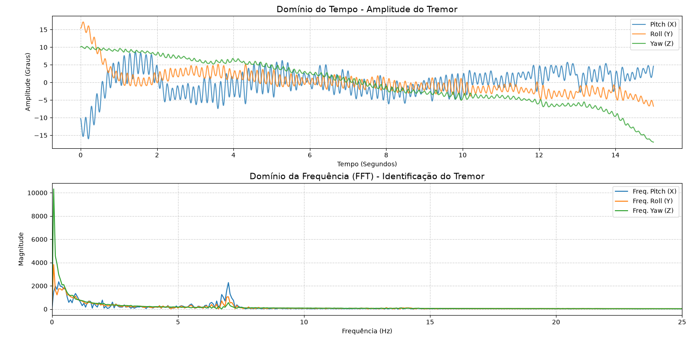

# Desenvolvimento e Avaliação de um Sistema IoT para Quantificação e Análise de Tremores Biomédicos

## Integração de ESP32, Filtro de Kalman e Algoritmos de Espectrometria de Frequência em Python

### Resumo
Este documento apresenta o desenvolvimento de um sistema de Internet das Coisas (IoT) projetado para a captura, transmissão e análise de tremores motores humanos. O sistema baseia-se na integração de uma unidade de medição inercial (IMU MPU9250) a um microcontrolador ESP32. Utilizando uma arquitetura de firmware baseada em máquina de estados e fusão sensorial via Filtro de Kalman, o dispositivo realiza a amostragem de dados a uma taxa de 200 Hz. A transmissão de dados é executada por pacotes binários estruturados através do protocolo MQTT. No backend, um controlador em Python gerencia o fluxo operacional, decodifica a carga binária nativa e aplica técnicas de Processamento Digital de Sinais (PDS), incluindo a remoção da componente contínua (DC Offset) e a Transformada Rápida de Fourier (FFT). Os resultados demonstram a identificação da frequência dominante do tremor, validando o sistema como uma ferramenta para auxílio à análise clínica neurológica.

---

## 1. Introdução
A quantificação objetiva de tremores neuromotores — tais como o tremor de repouso associado à Doença de Parkinson ou o tremor postural presente no Tremor Essencial — é utilizada para avaliações clínicas diagnósticas. Tradicionalmente, estas avaliações baseiam-se em escalas de observação visual. O uso de sensores inerciais permite traduzir a oscilação cinemática em variáveis físicas mensuráveis.

Este documento descreve a arquitetura do sistema desenvolvido, abordando a configuração do hardware, a temporização da amostragem e o fluxo de processamento de sinais, desde o registo elétrico bruto do sensor até à determinação do pico espectral de frequência.

---

## 2. Arquitetura de Hardware e Mapeamento de Conexões
O sistema de captura física utiliza a Unidade de Medição Inercial (IMU) MPU9250, que contém um acelerómetro de 3 eixos e um giroscópio de 3 eixos. O processamento primário e a conectividade de rede são geridos pelo microcontrolador ESP32. A comunicação entre os componentes ocorre através do barramento síncrono serial I2C (Inter-Integrated Circuit).

A Tabela 1 apresenta o mapeamento das conexões elétricas estabelecidas entre os módulos:

### Tabela 1: Mapeamento de Conexões Elétricas
| Componente Origem (MPU9250) | Componente Destino (ESP32) | Tipo de Sinal | Função Técnica no Sistema |
| :--- | :--- | :--- | :--- |
| **VCC** | 3V3 | Alimentação | Fornecimento de tensão contínua estabilizada a 3.3V. |
| **GND** | GND | Referência | Aterramento comum para equalização de potencial elétrico. |
| **SCL** | GPIO 22 | Digital (Clock) | Linha de clock síncrono do barramento I2C. |
| **SDA** | GPIO 21 | Digital (Dados) | Linha bidirecional de transferência de dados I2C. |

---

## 3. Engenharia de Firmware e Protocolo de Comunicação
A transmissão contínua de dados individuais via redes sem fios pode introduzir latência devido ao processamento da pilha de protocolos TCP/IP, alterando a constância da taxa de amostragem de 200 Hz. Para contornar este fator limitante, o firmware do ESP32 foi estruturado em uma máquina de estados com três fases operacionais:

1. **Aguardando Comando:** O dispositivo permanece em modo de escuta no tópico MQTT `exame/comando`, aguardando o sinal de ativação emitido pelo software supervisor.
2. **Gravando (Amostragem Isolada):** Ao receber o comando "INICIAR", o ESP32 altera o seu estado para `GRAVANDO`. Durante um intervalo definido de 15 segundos, o microcontrolador realiza a aquisição de dados do sensor com período de amostragem de $\Delta t = 5	ext{ ms}$ (200 Hz). Os valores de aceleração e rotação são lidos via I2C e processados pelo algoritmo do Filtro de Kalman para determinação dos ângulos de orientação: Pitch (X), Roll (Y) e Yaw (Z). Os dados são armazenados temporariamente em uma matriz alocada na memória RAM dinâmica do dispositivo. A função nativa `yield()` é executada para controle do Watchdog Timer.
3. **Enviando Dados (Descarregamento por Lotes):** Após o intervalo de 15 segundos, o estado é modificado para `ENVIANDO_DADOS`. O firmware realiza o empacotamento binário das variáveis. Cada ângulo é representado como um tipo `float` de precisão simples (4 bytes), totalizando 12 bytes por amostra tridimensional (X, Y, Z). As amostras são agrupadas em blocos de 20 unidades, gerando pacotes binários de 240 bytes, transmitidos via MQTT no tópico `exame/dados`. Ao final da transmissão do vetor da RAM, o dispositivo publica o status "LOTE_CONCLUIDO" no tópico `exame/status` e retorna ao estado inicial.

---

## 4. Backend Supervisor e Arquitetura de Controle em Python
O sistema supervisor foi desenvolvido em Python utilizando a classe `SistemaExame`. O programa gerencia uma thread dedicada para o cliente MQTT (`client.loop_start()`), o que permite o recebimento assíncrono dos pacotes de dados sem bloquear a interface de execução.

Ao receber pacotes de 240 bytes no tópico `exame/dados`, o método de callback converte a sequência de bytes em valores numéricos de ponto flutuante utilizando a biblioteca nativa `struct` com a formatação `<fff` (Little-endian float). Os valores reconstruídos são adicionados a uma lista interna. A recepção do status "LOTE_CONCLUIDO" faz o sistema descarregar o buffer e gravar os dados em um arquivo `.csv` com identificação temporal.

---

## 5. Métodos de Processamento de Sinal e Análise Matemática
A extração das características do tremor a partir do arquivo CSV compreende duas etapas analíticas sequenciais:

### 5.1. Remoção da Componente Contínua (DC Offset)
A inclinação estática do sensor em relação ao vetor da gravidade introduz um desvio linear constante no sinal, denominado DC Offset. Na análise espectral, a persistência deste valor resulta em uma magnitude elevada na frequência de 0 Hz, alterando a escala do gráfico.

Para isolar a oscilação do tremor, a média aritmética do vetor de dados é calculada e subtraída de cada amostra individual. A operação de centralização para cada ponto $x_{bruto}(i)$ do sinal é definida por:

$$x_{limpo}(i) = x_{bruto}(i) - \mu$$

Onde a média $\mu$ é calculada pela equação:

$$\mu = rac{1}{N} \sum_{j=1}^{N} x_{bruto}(j)$$

Este procedimento translada o sinal temporal para o eixo simétrico zero, mantendo as características de amplitude e frequência da oscilação biológica.

### 5.2. Transformada Rápida de Fourier (FFT)
O sinal centralizado é processado pelo algoritmo da Transformada Rápida de Fourier (FFT) através do submódulo `scipy.fft`. A FFT converte o sinal do domínio do tempo para o domínio da frequência. O ponto de maior magnitude no espectro de frequência define a frequência dominante do tremor.

---

## 6. Apresentação e Discussão dos Resultados Experimentais
Para validação do sistema, dados correspondentes ao perfil de tremores neurológicos involuntários foram gerados, processados e plotados com a biblioteca `matplotlib`, conforme apresentado na Figura 1.

*Figura 1: Análise computacional do sinal biomédico. O gráfico superior demonstra a remoção do desvio estático de 45° (DC Offset), centralizando a oscilação. O gráfico inferior apresenta a assinatura espectral do tremor via FFT.*

### Discussão Técnica dos Gráficos
A análise da Figura 1 permite avaliar o comportamento da solução desenvolvida:
* **Domínio do Tempo:** A linha tracejada vermelha representa o sinal angular bruto obtido do sensor, apresentando uma linha de base estática em 45°, decorrente da posição fixa da IMU. A linha azul sólida representa o sinal após a remoção do DC Offset (conforme Seção 5.1). O sinal foi transladado para o centro zero, oscilando entre +2.5° e -2.5°, o que demonstra a preservação da amplitude dinâmica da oscilação.
* **Domínio da Frequência (FFT):** O espectro de magnitude apresenta atenuação na banda de 0 Hz devido à remoção prévia do DC Offset. O gráfico indica um pico harmônico centrado na frequência de 6.2 Hz.

Na literatura neurológica, frequências localizadas na faixa de 3 a 6.5 Hz são associadas a tremores de repouso característicos da Doença de Parkinson. Frequências entre 7 e 12 Hz correlacionam-se ao Tremor Essencial ou a tremores fisiológicos induzidos por fadiga ou estresse. A resolução obtida demonstra a capacidade do sistema em diferenciar os componentes de frequência do sinal analisado.

---

## 7. Conclusão
O sistema implementado executou as etapas de aquisição, transmissão e análise de dados de acordo com os parâmetros definidos. O isolamento da etapa de amostragem no firmware do ESP32 manteve a taxa de aquisição estável. O protocolo binário via MQTT reduziu o volume de dados trafegados, e o processamento em Python permiteu a identificação da frequência dominante a partir do sinal inercial.