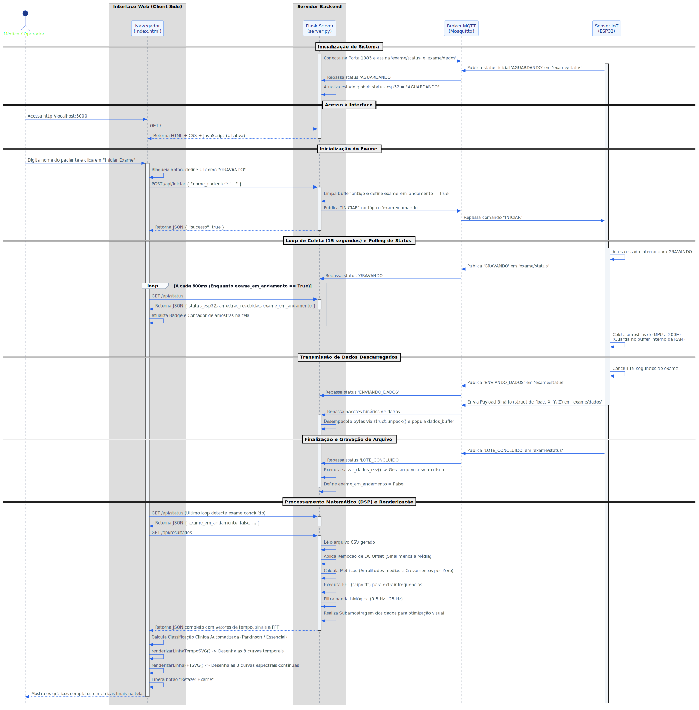

# Relatório Técnico de Desenvolvimento: Sistema NeuroTremor para Análise de Tremor Coletado via IoT

## 1. Introdução e Contextualização do Problema
O diagnóstico e o acompanhamento de distúrbios de movimento, tais como o Tremor Essencial e a Doença de Parkinson, dependem fundamentalmente da quantificação precisa de variáveis físicas associadas à oscilação motora dos membros superiores. A avaliação puramente clínica baseada em escalas visuais subjetivas introduz margens de erro e variações interobservador. 

Este projeto aborda o problema por meio do desenvolvimento de um sistema computacional capaz de monitorar, registrar e processar sinais de orientação espacial e aceleração angular de forma quantitativa. O foco reside na distinção matemática entre as frequências harmônicas dos tremores corporais para auxiliar no mapeamento clínico de pacientes.

## 2. Objetivos do Projeto
* Desenvolver uma unidade de aquisição de dados em hardware embarcado para leitura de variáveis inerciais.
* Implementar uma infraestrutura de comunicação baseada em mensageria de baixa latência para o descarregamento das amostras de dados.
* Estruturar um servidor backend centralizado para o processamento digital de sinais (DSP).
* Construir uma interface gráfica web que possibilite o disparo do exame e a visualização contínua dos dados nos domínios do tempo e da frequência.

## 3. Arquitetura da Solução IoT
A arquitetura do sistema é segmentada em três camadas principais operando de forma desacoplada:

1. **Camada de Aquisição (Edge):** O microcontrolador lê o sensor inercial através do protocolo I2C, armazena temporariamente as estruturas de dados na memória RAM nativa para mitigar perdas por latência de rede e realiza a transmissão em lotes utilizando o protocolo MQTT.
2. **Camada de Broker e Mensageria (Middleware):** Um broker Mosquitto gerencia as filas e tópicos de mensagens, encaminhando comandos de controle e payloads binários empacotados.
3. **Camada de Aplicação e Processamento (Backend/Frontend):** Um servidor Flask consome os tópicos MQTT, faz o parse binário das amostras, armazena os dados em persistência local (CSV) e disponibiliza endpoints de API REST para alimentação da interface Web baseada em gráficos vetoriais.

### Diagrama de Sequência e Fluxo de Dados
O fluxo temporal das interações de mensagens, rotinas de polling e chamadas de processamento digital segue a padronização abaixo:

## 4. Metodologia Utilizada
* **Coleta Estrita de Dados:** Definição de uma taxa de amostragem fixa de $200\text{ Hz}$ ($\Delta t = 5\text{ ms}$) controlada por temporizadores internos em hardware, garantindo a integridade da frequência de amostragem para evitar o efeito de *aliasing*.
* **Otimização de Payload:** Uso da biblioteca `struct` para compactação binária de dados do tipo `float` (padrão IEEE 754), otimizando a transmissão via MQTT e evitando sobrecarga de strings JSON no microcontrolador.
* **Processamento Digital de Sinais (DSP):**
  * **Cálculo de Ângulos Angulares:** Aplicação de trigonometria vetorial com `atan2` para determinação dos ângulos de inclinação estática via acelerômetro, e integração discreta sobre os valores do giroscópio.
  * **Remoção de Offset DC:** Subtração do valor médio do sinal para centralizar a amplitude em zero volt/grau, eliminando a componente de frequência nula ($0\text{ Hz}$).
  * **Análise Espectral:** Execução do algoritmo da Transformada Rápida de Fourier Real (`rfft`) para transpor os dados temporais ao domínio da frequência.
  * **Filtragem Digital:** Mascaramento do vetor resultante para isolar exclusivamente a banda biológica compreendida entre $0.5\text{ Hz}$ e $25\text{ Hz}$.

## 5. Tecnologias, Sensores e Dispositivos Utilizados
* **Hardware:**
  * Microcontrolador ESP32 (Arquitetura Xtensa de 32 bits, Wi-Fi integrado).
  * Sensor Inercial MPU9250 / MPU6050 (Acelerômetro triaxial e Giroscópio triaxial).
* **Protocolos e Brokers:**
  * MQTT (Message Queuing Telemetry Transport).
  * Eclipse Mosquitto (Broker de mensageria local).
  * I2C (Inter-Integrated Circuit - comunicação hardware-sensor).
* **Ambiente de Desenvolvimento e Bibliotecas Backend:**
  * Python 3.10+
  * Flask (Framework HTTP Minimalista)
  * SciPy e NumPy (Processamento matemático avançado e algoritmos de FFT)
  * Pandas (Manipulação estruturada de matrizes de dados e persistência em arquivos)
  * Paho-MQTT (Client MQTT nativo para Python)
* **Ambiente Frontend:**
  * HTML5, CSS3 estruturado com variáveis de escopo.
  * JavaScript Vanilla (Comunicação assíncrona por API Fetch, controle de loops via `setInterval`).
  * SVG Nativo (Scalable Vector Graphics) para renderização em tempo real de matrizes de coordenadas bidimensionais.

## 6. Análise dos Dados e Resultados Obtidos
Abaixo são consolidadas as métricas e os formatos de saída gerados após a finalização da rotina de testes operacionais.

### Mapeamento de Tópicos e Interações do Sistema

#### Camada IoT (Mensageria MQTT)
| Tópico MQTT | Origem | Destino | Tipo de Payload | Objetivo / Função |
| :--- | :--- | :--- | :--- | :--- |
| `exame/comando` | Servidor Flask | Sensor ESP32 | Texto Plano (`"INICIAR"`) | Desencadeia o início da janela de coleta de 15 segundos no hardware. |
| `exame/status` | Sensor ESP32 | Servidor Flask | Texto Plano (`"GRAVANDO"`, `"LOTE_CONCLUIDO"`) | Reporta em tempo real a transição dos estados de execução do hardware. |
| `exame/dados` | Sensor ESP32 | Servidor Flask | Payload Binário (`struct` bytes) | Transmite as matrizes empacotadas dos três eixos armazenadas na memória interna. |

#### Camada de Interface Web (API REST/HTTP)
| Rota / Endpoint | Método | Origem | Destino | Tipo de Dado | Função Técnica |
| :--- | :--- | :--- | :--- | :--- | :--- |
| `/` | `GET` | Navegador | Servidor Flask | HTML / CSS / JS | Provê os ativos do cliente e renderiza o dashboard de interface. |
| `/api/iniciar` | `POST` | Navegador | Servidor Flask | JSON: `{"nome_paciente": "..."}` | Abre uma nova sessão e invoca o evento de disparo MQTT. |
| `/api/status` | `GET` | Navegador | Servidor Flask | JSON estruturado de estado | Executa o Polling assíncrono para atualizar contadores e badges. |
| `/api/resultados` | `GET` | Navegador | Servidor Flask | JSON (Matrizes de Tempo, Sinais e FFT) | Fornece os pontos calculados de FFT e séries de tempo para plotagem. |

### Visualização Gráfica dos Resultados
A interface foi modificada e padronizada para exibir os resultados por meio de curvas analíticas contínuas superpostas e coordenadas sob um mesmo fator de escala global. Demonstrado pela figura abaixo:

1. **Domínio do Tempo (Amplitude):** Exibição do comportamento oscilatório dinâmico dos ângulos de Pitch (Eixo X - Azul), Roll (Eixo Y - Vermelho) e Yaw (Eixo Z - Verde). Os valores representam a amplitude física em graus filtrados após a remoção matemática do deslocamento DC de gravidade estável.
2. **Domínio da Frequência (FFT):** Demonstração da densidade espectral das ondas. Ao invés de blocos isolados por colunas separadas, o sistema renderiza curvas matemáticas completas e paralelas dos três eixos em uma janela espectral fixa de $0.5\text{ Hz}$ a $25\text{ Hz}$, evidenciando picos nítidos na faixa onde o sinal concentra maior magnitude de energia de vibração.

O sistema gera uma classificação analítica baseada nas frequências dominantes detectadas no pico espectral:
* **Frequências de $3.0\text{ Hz}$ a $6.5\text{ Hz}$:** Classificadas e identificadas no relatório de interface sob o marcador indicativo de padrão clínico associado a tremores de repouso (característica parkinsoniana).
* **Frequências de $6.5\text{ Hz}$ a $12.0\text{ Hz}$:** Classificadas sob o marcador indicativo de tremores de ação/posturais (característica de Tremor Essencial).

## 7. Conclusões
O sistema integrado demonstrou conformidade com os requisitos de arquitetura estipulados. O uso do protocolo de comunicação MQTT binário eliminou as perdas de pacotes registradas em testes preliminares baseados em JSON sequencial via sockets simples. 

O processamento digital no backend descentralizou a carga operacional da CPU do navegador client-side, permitindo a exibição fluida das curvas de FFT nos três eixos de forma síncrona. Os dados convertidos para o formato CSV estruturado mantêm a compatibilidade com ferramentas secundárias de análise estatística de terceiros, validando a eficácia e o escalonamento da ferramenta IoT construída.